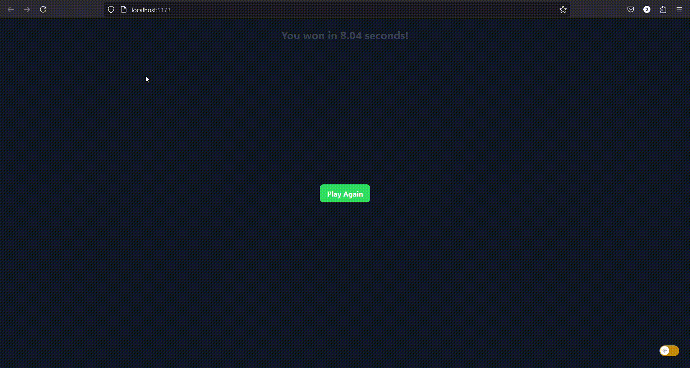

# Do A Click

A simple "catch the button" game built using React. The game begins when the user clicks the "Start Game" button.

## How the Game Works

- When the game starts, a button labeled 'Catch Me!' will appear on the screen at a random coordinate.
- As the user accidentally hovers over that location on the screen, a 'Caught Me!' button will appear.
- The player must click the 'Caught Me!' button, after which the time taken to find the hidden button is displayed.
- A "Play Again" button will also be available to restart the game.
- The coordinates where the button appears are displayed on the screen for the player's reference.
- The game features light and dark modes.



## Installation

1. Clone the repository:
    ```bash
    git clone https://github.com/unnikpanicker/do-a-click-game.git
    ```
2. Navigate to the project directory:
    ```bash
    cd do-a-click-game
    ```
3. Install the necessary dependencies:
    ```bash
    pnpm install
    ```
4. Start the development server:
    ```bash
    pnpm run dev
    ```

The app will be running on `http://localhost:5173`.
